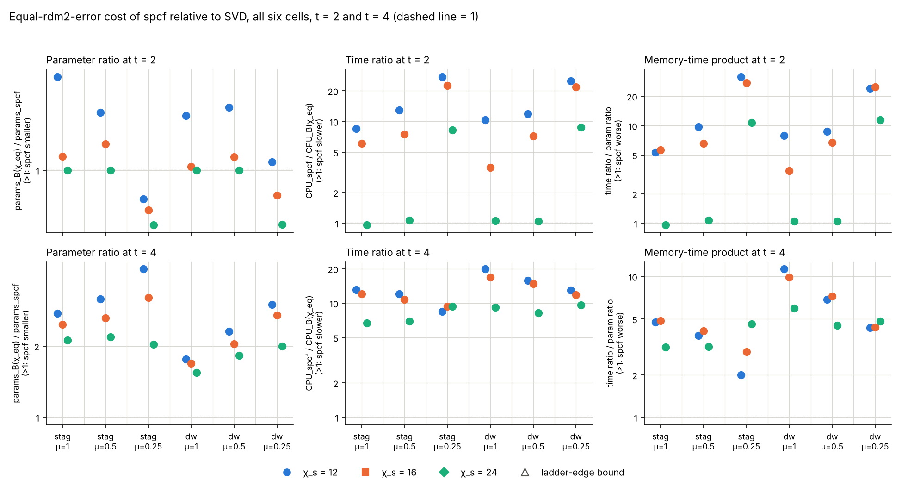
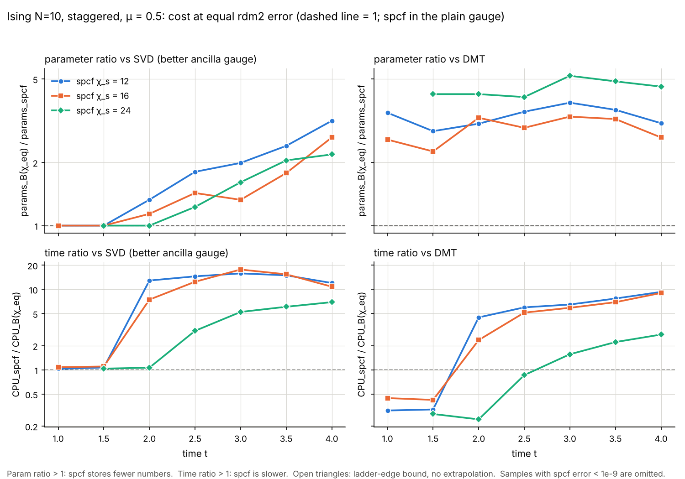

# Rank 2: cost of spcf at equal error, and how it changes during the evolution

Follow-up to `rank2_purification_results.md`. Question: at the SAME error, how much slower is spcf on a purification MPS than the baselines, and how many fewer stored parameters does it need, and does that change as the quench evolves? Everything is Ising, N = 10, dt = 0.1 Strang, T = 4, scored every 0.5 time units against the dense reference at that same time. Code: `rank2/eqerr_time.py` (runs), `rank2/eqerr_analysis.py` (matching, tables, figures), `rank2/run_eqerr.sh`. Raw series `rank2/results/eqerr_raw_<cell>.json`, ratios `eqerr_ratios.json`, medians and trend `eqerr_summary.json`, generated tables `eqerr_tables.md`.

## Headline

**Against SVD spcf never wins: it stores fewer parameters from t = 3 on in every cell (1.0 to 4.2×) but is 5 to 22× slower, and the memory-time product is above 1 in 89 of 90 entries at t >= 2. Against DMT it stores fewer parameters in every entry at t >= 2 (1.1 to 11.6×) but is mostly slower; it wins the memory-time product in 42 of 90 entries at t >= 2 (mostly mu = 1, chi_s = 24, and early times where spcf has barely started to fire) and loses it in the median at t = 4 (2.2×).** All numbers are medians over the 6 cells and the 3 spcf bond dimensions (18 entries), error metric rdm2, at the final time t = 4 (the sentence form of the task; ratios < 1 would be written "faster" / "more"):

- spcf is about 11× slower but uses about 2.2× fewer parameters than SVD (better ancilla gauge per sample). Memory-time product (time ratio / param ratio) 4.6, i.e. spcf is 4.6× worse. Per entry at t = 4 the product is above 1 in 18 of 18 cases (range 2.0 to 11.3).
- spcf is about 7.5× slower but uses about 3.4× fewer parameters than DMT. Memory-time product 2.2. Per entry the product is below 1 in 7 of 18 cases, all at mu = 1 or at chi_s = 24 with mu = 0.5, and above 1 at mu = 0.25 (median 5.5).
- For spcf at chi = 12 alone (the example of the brief): about 13× slower and 2.9× fewer parameters than SVD; about 8.7× slower and 3.2× fewer parameters than DMT. The example in the brief (spcf chi = 12 against SVD at chi = 24: about 10× slower, 3.3× fewer) is reproduced by the equal-error match in the staggered mu = 0.5 cell at t = 4: 12× slower, 3.2× fewer.
- Pooled over t = 2 to 4 (all cells, chi_s, sample times, 90 entries), the single overall memory-time product is **7.3 against SVD** (below 1 in 1 of 90 entries, and that one is a case where spcf had not fired yet, 0.96) and **1.4 against DMT** (below 1 in 42 of 90).
- nn_rms gives the same picture (median at t = 4: 2.2× fewer parameters, 11× slower vs SVD; 3.3× fewer, 7.8× slower vs DMT; pooled product 7.3 and 1.4).

Does the advantage grow during the evolution? **In parameters against SVD, yes; in the memory-time product against DMT, no, it erodes.** Details and the caveat that makes the early times uninformative are in "Trend over time".

## Setup in one paragraph

Cells: staggered and domain-wall initial states at mu = 1, 0.5, 0.25. spcf runs in the gauge that Test 2 used (plain at mu = 1 and 0.5, back at mu = 0.25), configuration of Test 2 unchanged (a = 2, fw = 0, 4 CG iterations, tau = 1, ks = 1-2-3), chi_s in {12, 16, 24}. SVD purification on chi in {8, 12, 16, 20, 24, 32, 40, 48, 64, 80, 96} in BOTH gauges; per (chi, t, metric) the baseline error is the better of the two gauges (a baseline-friendly choice; the "SVD in spcf's own gauge only" variant changes the pooled t >= 2 medians from 1.6 / 13 / 7.3 to 1.7 / 11 / 5.5, param / time / product, and never changes a verdict). DMT (`dmt` arm of `test2_dmt.py`, radius 1) on chi in {12, 16, 20, 24, 32, 40, 48, 64, 80, 96}. One TEBD trajectory per (arm, chi), paused every 5 steps; CPU is `time.process_time` summed over the TEBD only (scoring excluded), 3 single-threaded workers (OMP/OPENBLAS/MKL = 1, asserted), parameters are the actual stored tensor sizes at that time. spcf CPU includes the one-off construction of its state-independent F matrices (about 0.2 s; 10 percent of spcf CPU at t = 2 in the median, 2 percent at t = 4). The dense reference is the plain-gauge purification at all 8 sample times (snapshots in `rank2/_refcache/`, git-ignored); the physical rho does not depend on the gauge. Check: the new series reproduce the 105 final or t = 3 entries of the existing `test2_*.json` (SVD plain / back, spcf, DMT) with maximal relative difference 4e-16 in rdm2. No ladder had to be pruned: a whole cell (35 trajectories) takes about 1 minute on 3 workers, the 6 cells about 6 minutes, no timeout was hit.

Matching (`eqerr_analysis.py`): at each t and chi_s, log(error) against log(chi) is interpolated piecewise linearly along the baseline's ladder (after making the baseline error monotone, err_env(chi) = min over chi' <= chi), inverted at spcf's error to get chi_eq; params_B(chi_eq) and cpu_B(chi_eq, t) (cumulative CPU to t) are interpolated in log-log along the same ladder. param_ratio = params_B(chi_eq) / params_spcf, time_ratio = cpu_spcf / cpu_B(chi_eq), product = time_ratio / param_ratio. If chi_eq falls outside the ladder the value is clamped to the ladder end and flagged as a bound (no extrapolation): chi_eq above the ladder gives param_ratio >= and time_ratio <= and product <=. Samples where spcf's error is below 1e-9 are not matched ("exact"). Sentence convention below: "about X× slower but uses about Y× fewer parameters" is kept literally; where a ratio is below 1 it reads "faster" / "more" with the inverse number; bounds are marked ≥ / ≤ on the printed number.

## Medians across the 6 cells

Entries are param_ratio / time_ratio / product. Product > 1 means spcf is worse on the memory-time product. `n` is the number of matched (cell, chi_s) entries (not "exact"); `*k` means k of them are ladder-edge bounds (they enter the median at their clamped value).

### Medians across the 6 cells, error metric = rdm2

Entries are `param_ratio / time_ratio / product`; n = cells with a matched entry (not "exact"); `*k` = k of them are ladder-edge bounds.

| baseline | t | χ_s = 12 | χ_s = 16 | χ_s = 24 | all χ_s pooled |
|---|---|---|---|---|---|
| SVD | 1 | 1.00 / 1.17 / 1.17 (n=6) | 0.69 / 1.84 / 3.88 (n=4) | 0.56 / 1.87 / 3.32 (n=2) | 0.78 / 1.55 / 2.27 (n=12) |
| SVD | 2 | 1.32 / 12.4 / 9.21 (n=6) | 1.04 / 7.33 / 6.65 (n=6) | 1.00 / 1.06 / 1.06 (n=6) | 1.01 / 8.33 / 7.34 (n=18) |
| SVD | 3 | 1.93 / 15.7 / 8.03 (n=6) | 1.41 / 16.5 / 12.0 (n=6) | 1.38 / 5.94 / 4.19 (n=6) | 1.49 / 15.2 / 9.05 (n=18) |
| SVD | 4 | 2.88 / 13.0 / 4.54 (n=6) | 2.55 / 11.9 / 4.61 (n=6) | 2.02 / 8.69 / 4.56 (n=6) | 2.24 / 11.3 / 4.56 (n=18) |
| SVD | pooled 2-4 | 1.86 / 15.3 / 7.99 (n=30) | 1.50 / 14.9 / 8.89 (n=30) | 1.38 / 6.80 / 4.16 (n=30) | 1.59 / 12.9 / 7.34 (n=90) |
| DMT | 1 | 3.51 / 0.36 / 0.10 (n=6) | 1.88 / 0.58 / 0.38 (n=4) | 1.25 / 0.91 / 0.73 (n=2) | 1.92 / 0.52 / 0.35 (n=12) |
| DMT | 2 | 3.07 / 4.40 / 1.43 (n=6) | 2.84 / 2.57 / 0.94 (n=6) | 4.37 / 0.23 / 0.05 (n=6) | 3.17 / 2.73 / 0.94 (n=18) |
| DMT | 3 | 3.78 / 6.46 / 1.71 (n=6) | 4.08 / 5.00 / 1.31 (n=6) | 5.01 / 1.59 / 0.32 (n=6) | 4.35 / 5.00 / 1.26 (n=18) |
| DMT | 4 | 3.24 / 8.71 / 2.70 (n=6) | 3.03 / 7.97 / 2.72 (n=6) | 4.45 / 2.79 / 0.63 (n=6, *1) | 3.42 / 7.52 / 2.20 (n=18, *1) |
| DMT | pooled 2-4 | 3.45 / 6.46 / 1.88 (n=30) | 3.29 / 5.52 / 1.77 (n=30) | 4.55 / 1.59 / 0.32 (n=30, *2) | 3.54 / 4.59 / 1.43 (n=90, *2) |

### Medians across the 6 cells, error metric = nn_rms

Entries are `param_ratio / time_ratio / product`; n = cells with a matched entry (not "exact"); `*k` = k of them are ladder-edge bounds.

| baseline | t | χ_s = 12 | χ_s = 16 | χ_s = 24 | all χ_s pooled |
|---|---|---|---|---|---|
| SVD | 1 | 1.00 / 1.17 / 1.17 (n=6) | 0.69 / 1.84 / 3.88 (n=4) | 0.56 / 1.87 / 3.32 (n=2) | 0.78 / 1.55 / 2.27 (n=12) |
| SVD | 2 | 1.33 / 12.3 / 9.11 (n=6) | 1.05 / 7.29 / 6.56 (n=6) | 1.00 / 1.06 / 1.06 (n=6) | 1.01 / 8.03 / 7.16 (n=18) |
| SVD | 3 | 1.96 / 15.5 / 7.87 (n=6) | 1.41 / 16.4 / 11.8 (n=6) | 1.41 / 5.86 / 4.08 (n=6) | 1.50 / 15.1 / 8.65 (n=18) |
| SVD | 4 | 2.79 / 13.3 / 4.80 (n=6) | 2.56 / 11.9 / 4.61 (n=6) | 1.99 / 8.55 / 4.59 (n=6) | 2.22 / 11.2 / 4.61 (n=18) |
| SVD | pooled 2-4 | 1.86 / 15.1 / 7.82 (n=30) | 1.52 / 14.7 / 8.69 (n=30) | 1.41 / 6.62 / 3.92 (n=30) | 1.61 / 12.8 / 7.25 (n=90) |
| DMT | 1 | 3.51 / 0.36 / 0.10 (n=6) | 1.88 / 0.58 / 0.38 (n=4) | 1.25 / 0.91 / 0.73 (n=2) | 1.92 / 0.52 / 0.35 (n=12) |
| DMT | 2 | 3.10 / 4.38 / 1.41 (n=6) | 2.86 / 2.56 / 0.93 (n=6) | 4.36 / 0.23 / 0.05 (n=6) | 3.20 / 2.72 / 0.93 (n=18) |
| DMT | 3 | 3.88 / 6.31 / 1.63 (n=6) | 4.40 / 4.67 / 1.15 (n=6) | 5.08 / 1.57 / 0.31 (n=6) | 4.41 / 4.67 / 1.15 (n=18) |
| DMT | 4 | 3.14 / 8.98 / 2.91 (n=6) | 2.87 / 8.28 / 2.93 (n=6) | 4.46 / 2.78 / 0.62 (n=6, *1) | 3.28 / 7.77 / 2.37 (n=18, *1) |
| DMT | pooled 2-4 | 3.43 / 6.31 / 1.78 (n=30) | 3.20 / 5.37 / 1.68 (n=30) | 4.53 / 1.57 / 0.31 (n=30, *2) | 3.53 / 4.56 / 1.41 (n=90, *2) |

`n` is smaller than 18 at t = 1 because spcf at chi = 16 and 24 has an error below 1e-9 in most cells; those samples are not matched.

## Trend over time

Median over all cells and chi_s at every sample time, error rdm2:

| t | vs SVD | vs DMT |
|---|---|---|
| 0.5 | 0.54 / 2.00 / 3.71 (n=2) | 1.67 / 0.61 / 0.36 (n=2) |
| 1 | 0.78 / 1.55 / 2.27 (n=12) | 1.92 / 0.52 / 0.35 (n=12) |
| 1.5 | 1.00 / 1.09 / 1.09 (n=18) | 2.84 / 0.32 / 0.11 (n=18) |
| 2 | 1.01 / 8.33 / 7.34 (n=18) | 3.17 / 2.73 / 0.94 (n=18) |
| 2.5 | 1.34 / 13.0 / 8.48 (n=18) | 3.79 / 4.43 / 1.20 (n=18) |
| 3 | 1.49 / 15.2 / 9.05 (n=18) | 4.35 / 5.00 / 1.26 (n=18) |
| 3.5 | 1.83 / 15.2 / 7.11 (n=18) | 3.54 / 6.72 / 2.03 (n=18) |
| 4 | 2.24 / 11.3 / 4.56 (n=18) | 3.42 / 7.52 / 2.20 (n=18) |

Reading (all of it only up to T = 4):

1. **Until about t = 1.5 to 2, spcf is SVD.** spcf only fires when a cut discards weight above its threshold; before that its run is identical to SVD at the same chi (e.g. staggered mu = 0.5, chi = 12: rdm2 1.598e-12, 4.637e-08, 2.018e-05 at t = 0.5, 1, 1.5 for both). Its first fired cut falls in (1.5, 2] for chi_s = 12 and 16 and in (2, 2.5] for chi_s = 24 at mu = 1 and 0.5, and one half step earlier at mu = 0.25 (counters in the raw JSON). So at t <= 1.5 spcf's ratios against SVD are 1.0 in the mu = 1 and 0.5 cells and the time ratio is about 1; at mu = 0.25 (spcf in the back gauge) the parameter ratios are below 1 because SVD in the plain gauge is the better baseline early on. Against DMT the early "wins" (time ratio 0.3, product 0.1 at t = 1.5) are SVD's wins over DMT, not spcf's: DMT (chi' = chi - 8 in the bulk) already has an error of 1.5e-6 at t = 0.5 in staggered mu = 0.5 at chi = 12, where the purification SVD is at 1.6e-12, so DMT needs chi_eq of 25 to 55 to match spcf there. Do not read them as a spcf advantage.
2. **Against SVD the parameter advantage grows with time**: median param_ratio 1.0 (t <= 2), 1.3 (2.5), 1.5 (3), 1.8 (3.5), 2.2 (4); between t = 2 and 4 it rises in 18 of 18 (cell, chi_s) series (median factor 2.2). The time ratio jumps from about 1 to about 8 to 15 when spcf starts to fire (t between 1.5 and 2.5 depending on chi_s and mu), peaks at 15 around t = 3 to 3.5 and eases to 11 at t = 4 (it rises from t = 2 to 4 in 13 of 18 series, but only because the chi_s = 24 series start at 1). The memory-time product therefore peaks at about 9 at t = 3 and falls to 4.6 at t = 4 (it is lower at t = 4 than at t = 2 in 11 of 18 series, median factor 0.8). The advantage is real and growing, but it is still a loss on the product at T = 4; whether it would cross 1 at longer times is not tested and not extrapolated.
3. **Against DMT the parameter advantage is roughly constant, the time disadvantage grows, so the product erodes**: median param_ratio 2.8 (t = 1.5), 3.2 (2), 3.8 (2.5), 4.4 (3), 3.5 (3.5), 3.4 (4); time ratio 0.3, 2.7, 4.4, 5.0, 6.7, 7.5; product 0.1, 0.9, 1.2, 1.3, 2.0, 2.2. The product vs DMT rises from t = 2 to 4 in 14 of 18 series (median factor 1.7). spcf is ahead of DMT on the product at t = 4 only at mu = 1 (median 0.33, DMT is weakest near pure states) and at chi_s = 24 at mu = 0.5; at mu = 0.25 it is behind by 5.5×.
4. **Dependence on mu at t = 4** (median over 2 families and 3 chi_s; param / time / product): vs SVD, mu = 1: 1.9 / 12.6 / 5.4, mu = 0.5: 2.2 / 11.4 / 4.3, mu = 0.25: 2.9 / 9.5 / 4.4. Vs DMT, mu = 1: 8.5 / 3.0 / 0.33, mu = 0.5: 3.4 / 7.5 / 2.2, mu = 0.25: 2.0 / 11.9 / 5.5. Only 6 entries per row.
5. **chi_s.** The smaller spcf bond dimension gets the larger parameter ratio against SVD at t = 4 (2.9, 2.6, 2.0 for chi_s = 12, 16, 24) and the larger time ratio (13, 12, 8.7).

## Per-cell statements (error = rdm2)

Sentences at t = 1, 2, 3, 4 for each cell, spcf against SVD (better of the two ancilla gauges) and against DMT. The same numbers for every sample time and for nn_rms are in `rank2/results/eqerr_ratios.json`.

Per-cell figures `rank2/figures/eqerr_<family>_mu<mu>.png`: parameter ratio and time ratio against time, against SVD and against DMT, one line per chi_s, log y-axis, dashed line at 1, open triangles mark ladder-edge bounds (only 4 records, listed under Caveats).

#### staggered, mu = 1 (spcf in the plain gauge)

| t | spcf vs SVD (better gauge), error = rdm2 | spcf vs DMT, error = rdm2 |
|---|---|---|
| 1 | spcf (χ=12) is about 1.2× slower but uses about 1.0× fewer parameters than SVD | spcf (χ=12) is about 2.7× faster but uses about 3.6× fewer parameters than DMT |
| 1 | spcf (χ=16) has error 9e-10 (< 1e-9): nothing truncated yet, not matched | spcf (χ=16) has error 9e-10 (< 1e-9): nothing truncated yet, not matched |
| 1 | spcf (χ=24) has error 3e-13 (< 1e-9): nothing truncated yet, not matched | spcf (χ=24) has error 3e-13 (< 1e-9): nothing truncated yet, not matched |
| 2 | spcf (χ=12) is about 8.5× slower but uses about 1.6× fewer parameters than SVD | spcf (χ=12) is about 2.4× slower but uses about 5.5× fewer parameters than DMT |
| 2 | spcf (χ=16) is about 6.0× slower but uses about 1.1× fewer parameters than SVD | spcf (χ=16) is about 1.6× slower but uses about 4.0× fewer parameters than DMT |
| 2 | spcf (χ=24) is about 1.0× faster but uses about 1.0× fewer parameters than SVD | spcf (χ=24) is about 6.6× faster but uses about 6.7× fewer parameters than DMT |
| 3 | spcf (χ=12) is about 14× slower but uses about 2.1× fewer parameters than SVD | spcf (χ=12) is about 3.5× slower but uses about 7.2× fewer parameters than DMT |
| 3 | spcf (χ=16) is about 15× slower but uses about 1.4× fewer parameters than SVD | spcf (χ=16) is about 3.2× slower but uses about 6.2× fewer parameters than DMT |
| 3 | spcf (χ=24) is about 5.5× slower but uses about 1.4× fewer parameters than SVD | spcf (χ=24) is about 1.3× faster but uses about 8.5× fewer parameters than DMT |
| 4 | spcf (χ=12) is about 13× slower but uses about 2.8× fewer parameters than SVD | spcf (χ=12) is about 5.6× slower but uses about 5.0× fewer parameters than DMT |
| 4 | spcf (χ=16) is about 12× slower but uses about 2.5× fewer parameters than SVD | spcf (χ=16) is about 4.3× slower but uses about 5.8× fewer parameters than DMT |
| 4 | spcf (χ=24) is about 6.7× slower but uses about 2.1× fewer parameters than SVD | spcf (χ=24) is about 1.4× slower but uses about 8.2× fewer parameters than DMT |

#### staggered, mu = 0.5 (spcf in the plain gauge)

| t | spcf vs SVD (better gauge), error = rdm2 | spcf vs DMT, error = rdm2 |
|---|---|---|
| 1 | spcf (χ=12) is about 1.0× slower but uses about 1.0× fewer parameters than SVD | spcf (χ=12) is about 3.2× faster but uses about 3.4× fewer parameters than DMT |
| 1 | spcf (χ=16) is about 1.1× slower but uses about 1.0× fewer parameters than SVD | spcf (χ=16) is about 2.2× faster but uses about 2.6× fewer parameters than DMT |
| 1 | spcf (χ=24) has error 1e-12 (< 1e-9): nothing truncated yet, not matched | spcf (χ=24) has error 1e-12 (< 1e-9): nothing truncated yet, not matched |
| 2 | spcf (χ=12) is about 13× slower but uses about 1.3× fewer parameters than SVD | spcf (χ=12) is about 4.5× slower but uses about 3.1× fewer parameters than DMT |
| 2 | spcf (χ=16) is about 7.5× slower but uses about 1.1× fewer parameters than SVD | spcf (χ=16) is about 2.3× slower but uses about 3.3× fewer parameters than DMT |
| 2 | spcf (χ=24) is about 1.1× slower but uses about 1.0× fewer parameters than SVD | spcf (χ=24) is about 4.1× faster but uses about 4.2× fewer parameters than DMT |
| 3 | spcf (χ=12) is about 16× slower but uses about 2.0× fewer parameters than SVD | spcf (χ=12) is about 6.5× slower but uses about 3.9× fewer parameters than DMT |
| 3 | spcf (χ=16) is about 18× slower but uses about 1.3× fewer parameters than SVD | spcf (χ=16) is about 5.9× slower but uses about 3.3× fewer parameters than DMT |
| 3 | spcf (χ=24) is about 5.2× slower but uses about 1.6× fewer parameters than SVD | spcf (χ=24) is about 1.6× slower but uses about 5.2× fewer parameters than DMT |
| 4 | spcf (χ=12) is about 12× slower but uses about 3.2× fewer parameters than SVD | spcf (χ=12) is about 9.3× slower but uses about 3.1× fewer parameters than DMT |
| 4 | spcf (χ=16) is about 11× slower but uses about 2.6× fewer parameters than SVD | spcf (χ=16) is about 9.0× slower but uses about 2.6× fewer parameters than DMT |
| 4 | spcf (χ=24) is about 6.9× slower but uses about 2.2× fewer parameters than SVD | spcf (χ=24) is about 2.7× slower but uses about 4.6× fewer parameters than DMT |

#### staggered, mu = 0.25 (spcf in the back gauge)

| t | spcf vs SVD (better gauge), error = rdm2 | spcf vs DMT, error = rdm2 |
|---|---|---|
| 1 | spcf (χ=12) is about 2.1× slower but uses about 1.9× more parameters than SVD | spcf (χ=12) is about 1.7× faster but uses about 1.1× fewer parameters than DMT |
| 1 | spcf (χ=16) is about 2.6× slower but uses about 2.6× more parameters than SVD | spcf (χ=16) is about 1.3× faster but uses about 1.0× more parameters than DMT |
| 1 | spcf (χ=24) is about 1.9× slower but uses about 1.8× more parameters than SVD | spcf (χ=24) is about 1.1× faster but uses about 1.2× fewer parameters than DMT |
| 2 | spcf (χ=12) is about 28× slower but uses about 1.2× more parameters than SVD | spcf (χ=12) is about 12× slower but uses about 1.3× fewer parameters than DMT |
| 2 | spcf (χ=16) is about 23× slower but uses about 1.2× more parameters than SVD | spcf (χ=16) is about 11× slower but uses about 1.3× fewer parameters than DMT |
| 2 | spcf (χ=24) is about 8.2× slower but uses about 1.3× more parameters than SVD | spcf (χ=24) is about 4.8× slower but uses about 1.1× fewer parameters than DMT |
| 3 | spcf (χ=12) is about 16× slower but uses about 1.8× fewer parameters than SVD | spcf (χ=12) is about 14× slower but uses about 1.6× fewer parameters than DMT |
| 3 | spcf (χ=16) is about 22× slower but uses about 1.3× fewer parameters than SVD | spcf (χ=16) is about 13× slower but uses about 1.9× fewer parameters than DMT |
| 3 | spcf (χ=24) is about 16× slower but uses about 1.0× fewer parameters than SVD | spcf (χ=24) is about 10× slower but uses about 1.3× fewer parameters than DMT |
| 4 | spcf (χ=12) is about 8.4× slower but uses about 4.2× fewer parameters than SVD | spcf (χ=12) is about 12× slower but uses about 2.6× fewer parameters than DMT |
| 4 | spcf (χ=16) is about 9.3× slower but uses about 3.2× fewer parameters than SVD | spcf (χ=16) is about 14× slower but uses about 1.9× fewer parameters than DMT |
| 4 | spcf (χ=24) is about 9.4× slower but uses about 2.0× fewer parameters than SVD | spcf (χ=24) is about 10× slower but uses about 1.7× fewer parameters than DMT |

#### domain wall, mu = 1 (spcf in the plain gauge)

| t | spcf vs SVD (better gauge), error = rdm2 | spcf vs DMT, error = rdm2 |
|---|---|---|
| 1 | spcf (χ=12) is about 1.1× slower but uses about 1.0× fewer parameters than SVD | spcf (χ=12) is about 2.9× faster but uses about 3.6× fewer parameters than DMT |
| 1 | spcf (χ=16) has error 9e-10 (< 1e-9): nothing truncated yet, not matched | spcf (χ=16) has error 9e-10 (< 1e-9): nothing truncated yet, not matched |
| 1 | spcf (χ=24) has error 4e-13 (< 1e-9): nothing truncated yet, not matched | spcf (χ=24) has error 4e-13 (< 1e-9): nothing truncated yet, not matched |
| 2 | spcf (χ=12) is about 10× slower but uses about 1.3× fewer parameters than SVD | spcf (χ=12) is about 2.7× slower but uses about 4.8× fewer parameters than DMT |
| 2 | spcf (χ=16) is about 3.5× slower but uses about 1.0× fewer parameters than SVD | spcf (χ=16) is about 1.2× faster but uses about 4.5× fewer parameters than DMT |
| 2 | spcf (χ=24) is about 1.0× slower but uses about 1.0× fewer parameters than SVD | spcf (χ=24) is about 6.2× faster but uses about 6.5× fewer parameters than DMT |
| 3 | spcf (χ=12) is about 15× slower but uses about 1.9× fewer parameters than SVD | spcf (χ=12) is about 2.3× slower but uses about 12× fewer parameters than DMT |
| 3 | spcf (χ=16) is about 14× slower but uses about 1.5× fewer parameters than SVD | spcf (χ=16) is about 2.1× slower but uses about 8.5× fewer parameters than DMT |
| 3 | spcf (χ=24) is about 5.7× slower but uses about 1.4× fewer parameters than SVD | spcf (χ=24) is about 1.2× faster but uses about 8.5× fewer parameters than DMT |
| 4 | spcf (χ=12) is about 20× slower but uses about 1.8× fewer parameters than SVD | spcf (χ=12) is about 3.5× slower but uses about 8.8× fewer parameters than DMT |
| 4 | spcf (χ=16) is about 17× slower but uses about 1.7× fewer parameters than SVD | spcf (χ=16) is about 2.4× slower but uses about 9.4× fewer parameters than DMT |
| 4 | spcf (χ=24) is about 9.2× slower but uses about 1.5× fewer parameters than SVD | spcf (χ=24) is about ≤1.2× slower but uses about ≥10× fewer parameters than DMT |

#### domain wall, mu = 0.5 (spcf in the plain gauge)

| t | spcf vs SVD (better gauge), error = rdm2 | spcf vs DMT, error = rdm2 |
|---|---|---|
| 1 | spcf (χ=12) is about 1.1× slower but uses about 1.0× fewer parameters than SVD | spcf (χ=12) is about 2.9× faster but uses about 3.6× fewer parameters than DMT |
| 1 | spcf (χ=16) is about 1.0× slower but uses about 1.0× fewer parameters than SVD | spcf (χ=16) is about 2.3× faster but uses about 2.6× fewer parameters than DMT |
| 1 | spcf (χ=24) has error 1e-12 (< 1e-9): nothing truncated yet, not matched | spcf (χ=24) has error 1e-12 (< 1e-9): nothing truncated yet, not matched |
| 2 | spcf (χ=12) is about 12× slower but uses about 1.4× fewer parameters than SVD | spcf (χ=12) is about 4.3× slower but uses about 3.1× fewer parameters than DMT |
| 2 | spcf (χ=16) is about 7.2× slower but uses about 1.1× fewer parameters than SVD | spcf (χ=16) is about 2.8× slower but uses about 2.4× fewer parameters than DMT |
| 2 | spcf (χ=24) is about 1.0× slower but uses about 1.0× fewer parameters than SVD | spcf (χ=24) is about 4.6× faster but uses about 4.5× fewer parameters than DMT |
| 3 | spcf (χ=12) is about 16× slower but uses about 1.9× fewer parameters than SVD | spcf (χ=12) is about 6.4× slower but uses about 3.7× fewer parameters than DMT |
| 3 | spcf (χ=16) is about 15× slower but uses about 1.6× fewer parameters than SVD | spcf (χ=16) is about 4.1× slower but uses about 4.9× fewer parameters than DMT |
| 3 | spcf (χ=24) is about 6.2× slower but uses about 1.5× fewer parameters than SVD | spcf (χ=24) is about 1.6× slower but uses about 4.8× fewer parameters than DMT |
| 4 | spcf (χ=12) is about 16× slower but uses about 2.3× fewer parameters than SVD | spcf (χ=12) is about 8.1× slower but uses about 3.4× fewer parameters than DMT |
| 4 | spcf (χ=16) is about 15× slower but uses about 2.0× fewer parameters than SVD | spcf (χ=16) is about 6.9× slower but uses about 3.4× fewer parameters than DMT |
| 4 | spcf (χ=24) is about 8.2× slower but uses about 1.8× fewer parameters than SVD | spcf (χ=24) is about 2.8× slower but uses about 4.3× fewer parameters than DMT |

#### domain wall, mu = 0.25 (spcf in the back gauge)

| t | spcf vs SVD (better gauge), error = rdm2 | spcf vs DMT, error = rdm2 |
|---|---|---|
| 1 | spcf (χ=12) is about 2.2× slower but uses about 2.1× more parameters than SVD | spcf (χ=12) is about 1.6× faster but uses about 1.2× fewer parameters than DMT |
| 1 | spcf (χ=16) is about 2.8× slower but uses about 2.7× more parameters than SVD | spcf (χ=16) is about 1.4× faster but uses about 1.2× fewer parameters than DMT |
| 1 | spcf (χ=24) is about 1.9× slower but uses about 1.8× more parameters than SVD | spcf (χ=24) is about 1.1× faster but uses about 1.3× fewer parameters than DMT |
| 2 | spcf (χ=12) is about 25× slower but uses about 1.0× fewer parameters than SVD | spcf (χ=12) is about 10× slower but uses about 1.8× fewer parameters than DMT |
| 2 | spcf (χ=16) is about 22× slower but uses about 1.1× more parameters than SVD | spcf (χ=16) is about 9.4× slower but uses about 1.7× fewer parameters than DMT |
| 2 | spcf (χ=24) is about 8.8× slower but uses about 1.3× more parameters than SVD | spcf (χ=24) is about 4.7× slower but uses about 1.2× fewer parameters than DMT |
| 3 | spcf (χ=12) is about 17× slower but uses about 1.9× fewer parameters than SVD | spcf (χ=12) is about 14× slower but uses about 1.8× fewer parameters than DMT |
| 3 | spcf (χ=16) is about 22× slower but uses about 1.4× fewer parameters than SVD | spcf (χ=16) is about 13× slower but uses about 1.9× fewer parameters than DMT |
| 3 | spcf (χ=24) is about 14× slower but uses about 1.2× fewer parameters than SVD | spcf (χ=24) is about 9.2× slower but uses about 1.5× fewer parameters than DMT |
| 4 | spcf (χ=12) is about 13× slower but uses about 3.0× fewer parameters than SVD | spcf (χ=12) is about 12× slower but uses about 2.5× fewer parameters than DMT |
| 4 | spcf (χ=16) is about 12× slower but uses about 2.7× fewer parameters than SVD | spcf (χ=16) is about 13× slower but uses about 2.0× fewer parameters than DMT |
| 4 | spcf (χ=24) is about 9.6× slower but uses about 2.0× fewer parameters than SVD | spcf (χ=24) is about 9.1× slower but uses about 1.8× fewer parameters than DMT |

## Caveats

- **Timing noise.** Three repeats of the same run under the same 3-worker load gave a spread (max minus min over mean) of 1.0 percent for spcf chi = 12 (7.9, 8.0, 7.9 s), 2.8 percent for SVD chi = 24 (0.7 s) and 2.0 percent for DMT chi = 24 (0.85 s). The baselines' CPU times are small (0.1 to 1.5 s at the chi_eq that occur), so a time ratio carries a few percent of noise from this, plus the unknown effect of memory-bandwidth contention among the 3 workers on a 4-core machine (same for all arms). The larger uncertainty is the interpolation: the ladder steps are up to 1.33× in chi, the baseline error versus chi is not smooth (the monotone envelope changed 41 of the 192 baseline ladders, by at most 21 percent in error), so interpolation matters. Measured: re-running the matching with 3 to 4 ladder rungs removed (SVD {8,12,16,24,32,48,64,96} or {8,12,20,32,48,80,96}, DMT {12,16,24,32,48,64,96} or {12,20,32,48,80,96}) changes the individual rdm2 entries at t >= 2 (268 matched in both) by a median of 0.2 to 3.7 percent, a 90th percentile of 8 to 16 percent and a worst case of 34 percent, and moves the pooled t = 4 medians by at most 5 percent (e.g. vs SVD 2.24 / 11.3 / 4.56 becomes 2.36 / 11.3 / 4.44 or 2.24 / 11.1 / 4.42; vs DMT 3.42 / 7.52 / 2.20 becomes 3.46 / 7.4 / 2.14 or 3.46 / 7.2 / 2.09). The medians are what the conclusions rest on, and they are medians over 18 entries that share trajectories and a reference, not 18 independent samples.
- **What the time ratio measures.** CPU of three numpy implementations: full `np.linalg.svd` for the baselines (no truncated or randomised SVD), my own numpy DMT, and spcf's Gauss-Newton solve with Python-level overhead. A faster SVD routine in the baselines or a compiled spcf would shift the time ratios, and nothing here says by how much. The F-matrix set-up of spcf (about 0.2 s) is counted (up to a third of spcf's CPU at t = 2 in some cells, 2 to 3 percent at t = 4); excluding it would lower the t = 2 time ratios by up to that much and leave t = 4 unchanged.
- **Lower bounds.** 4 of 864 ratio records (2 times, 2 metrics) hit the edge of the ladder: domain wall mu = 1, chi_s = 24 against DMT at t = 3.5 and 4, where DMT at chi = 96 (129,576 parameters) is still worse than spcf at chi = 24 (12,832 parameters). They enter as param_ratio >= 10.1, time_ratio <= 1.0 (t = 3.5) or 1.2 (t = 4), product <= 0.10 or 0.12. No SVD match was out of range (SVD in the plain gauge at chi = 96 reaches 3e-6 to 2e-5 in rdm2 at t = 4, spcf at chi_s = 24 is at 1.2e-3 to 2.6e-3), and no match fell below the ladder. 132 of 864 records are "exact" (spcf error below 1e-9; 22 per metric and baseline, all at t = 0.5 or 1) and are not matched.
- **Equal error means equal on the scored quantity** (rdm2 or nn_rms), which is spcf's own objective. Far correlators (zzfar), energy and the trace distance are not matched here. The earlier report found far ZZ neutral to mildly worse for spcf and |dE| much better for DMT (35 of 36 entries); neither is part of these ratios. The zzfar, nnn_rms and |dE| series are in the raw JSON.
- **Gauge.** spcf runs in Test 2's gauge (back at mu = 0.25), SVD in the better of two gauges per sample. This is conservative for spcf at mu = 0.25, early times (SVD-plain beats spcf-back there). The gauge-fairness caveat of the earlier report (no Hauschild disentangler) still applies to the SVD baseline; DMT has no gauge.
- **Size and range.** N = 10, one model (Ising, one field set), T = 4, dt = 0.1, one realisation per cell. The purification bond could grow to 4^5 = 1024 in the middle and SVD at chi = 96 already reaches 1e-5 in rdm2, so the baselines have room to converge here; at larger N, longer T or different models the ratios can move either way and nothing here predicts the scaling. The trend over time is a trend over T <= 4 only.
- **Conventions.** The 8 sample times are 0.5 to 4; "t = 1, 2, 3, 4" in the tables are sample indices 2, 4, 6, 8. Medians treat bound entries at their clamped value (they are bounds on the true value; there are only 2 bound entries among the 90 pooled t >= 2 DMT entries per metric and none in the SVD ones, and removing them cannot move a median by more than one rank).
- **Process note.** I did not commit anything; a "WIP snapshot" commit (37a71d8) of partial files of this study was made by something else while the runs were in progress.

## Files

`rank2/eqerr_time.py`, `rank2/eqerr_analysis.py`, `rank2/run_eqerr.sh`; `rank2/results/eqerr_raw_{stag,dw}_mu{1,0.5,0.25}.json` (series), `eqerr_ratios.json`, `eqerr_summary.json`, `eqerr_tables.md`, `eqerr_run_*.log`; `rank2/figures/eqerr_<cell>.png` (6) and `eqerr_summary.png`; reference cache `rank2/_refcache/` (git-ignored). Reproduce: `bash rank2/run_eqerr.sh && python rank2/eqerr_analysis.py`.
