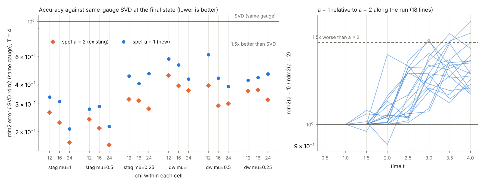
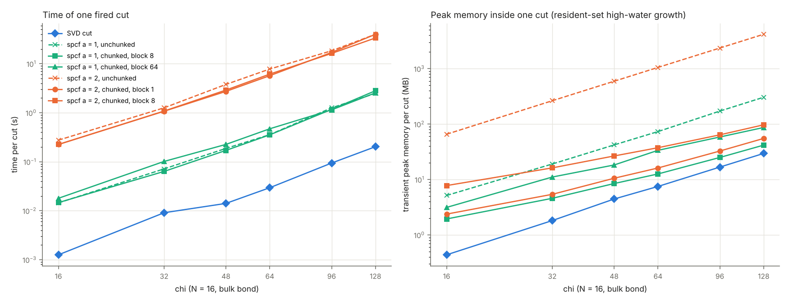
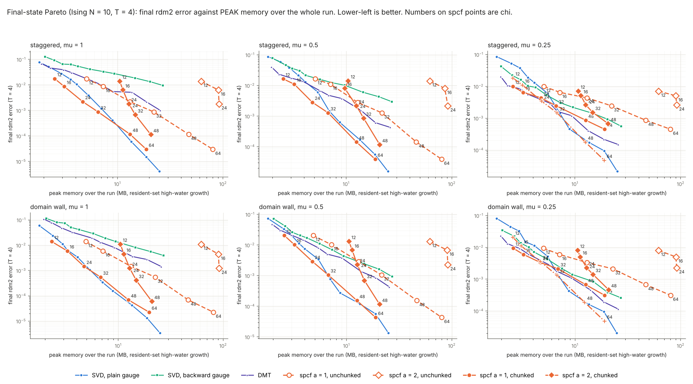
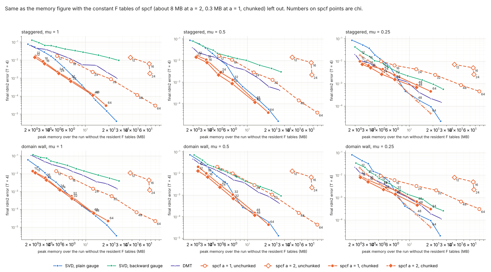
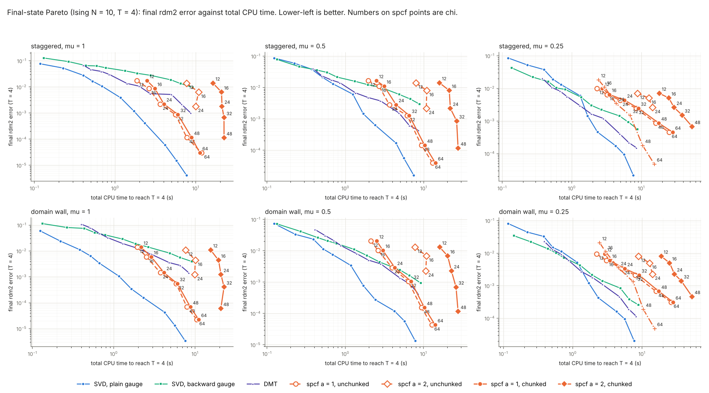

# Rank 2: can the purification spcf cut be made practical?

STATUS: complete. The pre-registration (next section) was written before any run of the new experiments (2026-10-08 20:45 UTC) and is unchanged; results start at "RESULTS", deviations are listed in section 5 of the results.

Question: spcf on a purification MPS beats SVD on local error at equal chi (2.5 to 4.7x lower rdm2, window a = 2) but costs about 10x SVD in time at equal error and its cut needs far more peak memory than an SVD cut (the window state W has about 4096 chi^2 numbers at a = 2). Judge by PEAK memory during the run and by TIME to reach the final state, not by stored parameters. Two approaches, in this order: (1) window a = 1, (2) a chunked window state. Code for the new work is in `rank2/` only, no existing file is modified, nothing is committed.

## Pre-registration

### P1. Approach 1, window a = 1 (accuracy)

Cells: staggered and domain wall, mu in {1, 0.5, 0.25}, Ising, N = 10, dt = 0.1, the gauge Test 2 used for spcf (plain at mu = 1 and 0.5, backward at mu = 0.25), chi in {12, 16, 24}: 18 (cell, chi) entries. Primary time T = 4, secondary T = 3 (same trajectories, sampled at t = 3).

Arms: SVD in the same gauge as spcf (existing `eqerr_raw_*.json`, `step2*.json`, `scan_svd_*.json`, `test2_*.json`), SVD in the other gauge (existing), spcf a = 2 (existing, not recomputed), spcf a = 1 (new; option string `1:0:4:1.0:1-2-3:0:1:1e-7:all:1e-2`, i.e. `pur_bench.DEFAULT_OPT` with the first field 1). Metrics at the final time: rdm2, nn_rms, nnn_rms, zzfar, trace distance, purification infidelity, |dE|.

Ratios: R_a = metric(spcf window a) / metric(SVD, same gauge), per entry. Lower is better, R < 1 means spcf wins.

"a = 1 keeps the gain" iff all three hold at T = 4 on the pooled median over the 18 entries:
- (C1) median R_1(rdm2) <= 1.5 x median R_2(rdm2) (a = 1 is at most 1.5x worse than a = 2 relative to SVD);
- (C2) median R_1(rdm2) <= 1/1.5 = 0.667 (a = 1 is at least 1.5x better than SVD);
- (C3) median over the 18 entries of zzfar(a = 1) / zzfar(SVD, same gauge) <= 1.5.

Supplementary, not decisive: the same three conditions per cell (median over its 3 chi), reported as a count out of 6; the same at T = 3; R for nn, nnn, trace distance, |dE|, infidelity.

Overfit check (a = 1 overfit in pure states: residual down, RDM error up): for every entry record the median over fired cuts of f_c / f_svd (region objective after / before) and the count of entries with R_1(rdm2) > 1. Overfit signature = median f_c/f_svd <= 0.5 together with R_1(rdm2) > 1.

Decision rule for the dependent work: if the pooled median R_1(rdm2) > 0.8 (gain smaller than 1.25x) then a = 1 is declared dead, and the a = 1 Pareto points and the chunked a = 1 are skipped. If C1 or C2 fails but the median R_1 <= 0.8 the outcome is "partial": the a = 1 Pareto is still run and the verdict says it does not meet the bar.

### P2. Approach 2, chunked window state

New subclass `rank2/spcfpur_chunk.py` (`SPCFPurChunk`), the cut never builds the full W: rho = W W^dag, the Jacobian-vector product and its adjoint are accumulated block by block over the outer index o' of the left environment map (block size `blk` is a parameter).

Validation (float64, `precision='f64'`) on random cells (random MPS, random two-site tensor, a in {1, 2}, several bonds including the chain edges, block sizes including ones that do not divide the outer dimension): relative difference chunked vs unchunked <= 1e-10 for the region RDM, the initial residual, jvp, vjp, and for the tensors returned by one full fired cut (<= 1e-9, a CG solve amplifies rounding); the adjoint identity <g, J x> = <J^T g, x> to <= 1e-10 for the chunked class. Float32 (the production precision): jvp/vjp relative difference <= 1e-4, cut tensors <= 1e-3, same accepted line-search step.

Cost measurements (cost_scaling setup: N = 16, bulk bond, random purification MPS with TEBD-like spectrum, truncation 4 chi -> chi, options of Tests 1 and 2 with every skip rule off): per-cut median time and per-cut transient peak memory (tracemalloc, with a process-level cross-check) for chi in {16, 32, 48, 64, 96, 128}, a in {1, 2}, several block sizes, against the SVD cut. Scaling exponents from a log-log least-squares fit over chi >= 32.

Criterion for "chunking works" (memory side only): at chi = 64, a = 2, the best block size has transient peak memory <= 3x the SVD cut's (unchunked: about 100x) with per-cut time <= 2x the unchunked time.

### P3. Pareto at the final state and the verdict

Same 6 cells, T = 4 only. Variants entering the plots: spcf a = 1 (if not dead), chunked a = 2 (if it passes P2), chunked a = 1 (if a = 1 not dead). Baselines: SVD plain gauge, SVD backward gauge (chi ladder 8 to 96), DMT (`dmt_np.py`, chi ladder 12 to 96). Error = final rdm2. Cost axes:
- (i) peak memory over the whole run = stored MPS + transient inside every cut + method-constant tables (spcf's state independent F matrices), measured as the process resident-memory high-water mark growth over the run (VmHWM reset just before the run, one fresh process per run), cross-checked with tracemalloc (decomposition into MPS / constants / transient) on all spcf points and a subset of baselines. N = 10, so the outer bonds of the a = 2 window are capped (at most 16) and W does not grow with chi in these runs; the growth with chi is therefore additionally measured per cut at N = 16 (P2) and used for a labelled projection;
- (ii) total CPU time to reach T (`time.process_time`, TEBD only, scoring excluded; 3 single-threaded workers, as in `eqerr_time.py`; the existing baseline times are reused).

A spcf point is ON the front for an axis iff no baseline point has cost <= and error <= its own (strict in one). The equal-error factor = cost of the spcf point / cost of the baseline lower envelope (non-dominated baseline points, log-log interpolation) at the spcf point's error; below 1 spcf is cheaper. A variant is "on the front in a cell" iff at least one of its points is on the front. Count over the 6 cells, separately for memory and for time.

"Practical" iff the best variant is on the front for both axes in at least 4 of 6 cells. "Memory-only" iff on the memory front in at least 4 of 6 cells and not on the time front in at least 4 of 6. Otherwise "not practical", stated as such.

Whether a = 1 or chunking changes "rank 2 is an accuracy-at-fixed-chi result only" is answered by the front counts and the equal-error factors, with ladder-edge cases flagged as bounds.

## RESULTS

### Verdict

Everything below is Ising, N = 10, dt = 0.1, T = 4, six cells, final state only, unless stated. "Factor" = cost of the spcf point divided by the cost the best baseline (SVD plain, SVD backward, DMT) needs for the same final rdm2; below 1 spcf is cheaper.

| | spcf variant | on the front in how many of 6 cells | equal-error factor (median; range over cells and chi) |
|---|---|---|---|
| (a) PEAK memory | a = 2 as published (unchunked) | 0 | 17.6 (13.3 to 24.2) |
| | a = 1 unchunked | 0 | 2.8 (1.4 to 8.6) |
| | **a = 1 chunked** | **6** | **0.94 (0.70 to 2.04); 0.85 at chi <= 24, 1.08 at chi >= 32** |
| | a = 2 chunked (as built, 8 MB of constant tables resident) | 0 | 2.2 (1.4 to 3.5) |
| | a = 2 chunked, constant tables left out (not built, see caveats) | 6 | 0.76 (0.57 to 1.50) |
| (b) TIME to T | a = 2 unchunked | 0 | 11.7 (6.7 to 19.9) |
| | a = 1 unchunked | 0 | 3.6 (2.0 to 10.6) |
| | a = 1 chunked | 0 | 4.2 (2.2 to 11.9) |
| | a = 2 chunked | 0 | 21 (5.7 to 40) |

Plainly: **spcf is on the time front in 0 of 6 cells for every variant, 2 to 12x slower than SVD at equal error for a = 1 and 6 to 40x for a = 2. It is on the memory front in 6 of 6 cells only in its chunked a = 1 form, and only by a small margin (equal-error memory 0.70 to 1.04x at chi <= 24, 0.87 to 1.22x at chi = 32 to 64 in the plain-gauge cells, up to 2x in the mu = 0.25 cells where spcf runs in the backward gauge). The measurement noise on memory is 0.4 to 3 percent, so the margin is real, but a 6 to 30 percent saving at N = 10 is not a practical gain, and it is bought with 2 to 12x the time.** By the rule written down before the runs ("practical" = front for both axes in at least 4 of 6 cells; "memory-only" = memory front in at least 4 of 6 and not time front) the outcome is "memory-only".

Does a = 1 or chunking change "rank 2 is an accuracy-at-fixed-chi result only"?
- **a = 1**: it keeps most of the accuracy gain (median rdm2 ratio to same-gauge SVD 0.43 against 0.31 for a = 2, pre-registered criteria met) at 7x the SVD run time instead of 28x (same chi). It does not change the equal-error time verdict: spcf is still 2 to 12x slower than SVD at equal error.
- **Chunking** removes the memory objection. The transient inside one cut at chi = 64, a = 2, goes from 1052 MB (140x the SVD cut) to 15.5 MB (2.1x), at chi = 128 from 4.2 GB to 55 MB (1.9x), with the same time per cut (0.8 to 1.0x the unchunked cut) and the same errors. That turns memory from a loss into a break-even to small win, for a = 1. It does nothing for time.
- So the conclusion stays: spcf is an accuracy-at-fixed-chi result. The one amendment is that its peak memory, once chunked, is no longer worse than SVD's at equal error (about 0.85x at chi <= 24, about 1.1x at chi >= 32 at N = 10, projected to about 0.75x at N = 100 because the stored MPS then dominates and spcf stores about 1.7x fewer parameters at equal error; that projection assumes the equal-error chi ratio of 1.3 measured at N = 10 carries over, which is untested). Time is where it loses and nothing built here changes that: the per-cut cost ratio to SVD is flat in chi (8 to 14x for a = 1, 120 to 270x for a = 2), so time break-even needs an accuracy gain worth a factor of chi_eq/chi_s of about 2 for a = 1 (whole-run time ratio 6.9 at equal chi, SVD time exponent about 2.5) and about 4 or more for a = 2; the measured ratio is 1.3 to 1.5.

### 1. Approach 1: window a = 1 (accuracy)

Run: `rank2/traj.py`, `traj_jobs.py` (spcf a = 1, 18 trajectories, `results/a1_traj.json`), analysis `a1_analysis.py` (`results/a1_analysis.txt`, `a1_analysis.json`, figure `figures/a1_accuracy.png`). The existing arms were reused: SVD in both gauges and spcf a = 2 from `eqerr_raw_*.json` (final and t = 3 samples), trace distance and infidelity of the existing arms from `test2_*`, `step2*`, `scan_svd_*`. One entry was missing there (staggered mu = 1, chi = 24, a = 2: trace distance and infidelity), so that single run was repeated and gives rdm2 1.8219e-3 identical to `eqerr_raw`; a second repeat (staggered mu = 0.5, chi = 12) is identical to all digits, so the new runner reproduces the old numbers exactly.

Pooled medians over the 18 (cell, chi) entries of R = metric(spcf) / metric(SVD, same gauge), T = 4 (lower is better):

| metric | a = 1 | a = 2 |
|---|---|---|
| rdm2 | 0.428 | 0.307 |
| nn rms | 0.449 | 0.325 |
| nnn rms | 0.702 | 0.633 |
| far ZZ | 0.893 | 0.855 |
| trace distance | 0.984 | 0.980 |
| purification infidelity | 1.000 | 1.000 |
| \|dE\| | 0.930 | 0.609 |

Pre-registered criteria (T = 4): C1 median R_1 <= 1.5 x median R_2: 0.428 <= 0.460 **pass** (ratio of medians 1.39; per entry R_1/R_2 has median 1.30, range 1.16 to 1.67, 3 of 18 entries above 1.5); C2 median R_1 <= 0.667: 0.428 **pass**; C3 far ZZ ratio <= 1.5: 0.893 **pass**. **a = 1 keeps the gain.** All 6 cells pass individually at T = 4; at T = 3 the pooled criteria pass too (R_1 0.341, R_2 0.265, far ZZ 1.04) and 5 of 6 cells pass (domain wall mu = 1 fails C1 by 0.487 against 0.479). a = 1 keeps 72 percent of a = 2's log-gain at T = 4 (81 percent at T = 3).

Margins and weaknesses: the C1 pass is narrow (1.39 against 1.5) and a = 1 loses ground over the evolution (R_1/R_2 starts at 1.0 until the first cut fires, about t = 1.5 to 2, and rises to a median 1.3 at t = 4, see the right panel of `a1_accuracy.png`); the energy error is worse than SVD's in 8 of 18 entries for a = 1 (2 of 18 for a = 2) and far ZZ in 6 of 18 (4 of 18). Both were already the weak spots of a = 2.

Overfit check (a = 1 in pure states: residual down, RDM error up): not seen. In all 18 entries the median ratio of the region objective after/before the cut over fired cuts is 0.10 to 0.38 (a drop of 62 to 90 percent) and the rdm2 error is below SVD's in every entry (R_1 0.21 to 0.62); zero entries with R_1 > 1. Here the objective and the scored quantity are the same RDM marginals on a purification, so the d = 2 pure-state overfit does not carry over to this setting.

Cost at equal chi, whole run N = 10 (median over the 18 entries): SVD 0.40 s, a = 1 2.66 s (6.9x), a = 2 10.4 s (27.9x; the a = 2 window is capped by the short chain, see the caveats).

Decision rule outcome: a = 1 is not dead (R_1 = 0.43 <= 0.8), so the a = 1 and chunked a = 1 Pareto points were run.

### 2. Approach 2: chunked window state

**What was built.** `rank2/spcfpur_chunk.py`, `SPCFPurChunk(SPCFPur)`. `SPCFPur.__call__` builds W = Wof(theta), a (D, no da^2 npp) matrix (at a = 2: 64 rows and 64 chi^2 columns, 4096 chi^2 numbers). rho = W W^dag, the product dW W0^dag inside the Jacobian-vector product and the back-projection H W0 inside the adjoint are all sums over the column index, whose first factor is the outer index o' of the left environment map (rows o0 nX : o1 nX of `Lm`, a contiguous slice). The subclass is a line-for-line copy of the cut in which these three places loop over blocks of `blk` values of o' and accumulate: rho is accumulated block by block; W0 for the current block is recomputed from the rank-k matrix in every jvp and vjp instead of being stored (about 9 extra Wof-sized contractions per cut at 4 CG iterations); the adjoint accumulates the d d r x l result block by block. Nothing else changed (SVD, tangent charts, retraction, line search, CG, firing rules). Two options added after the pre-registration, neither changes the algorithm: `w0_fast` recomputes W0 directly in complex64 instead of complex128 followed by the cast (25 percent less time, same accuracy at float32), and `lean_tables` keeps only the float32 copy of the residual table Fd (SPCFast keeps float64 and float32, about 3x the memory; a = 2: 24 MB to 8 MB resident). Block size `blk` is a constructor argument. W is never materialised (the test harness only assembles it in its debug hook).

**Validation** (`test_chunk.py`, `results/test_chunk.json`; `test_chunk_wf.py`). Section A: random purification MPS on N = 8 sites, random two-site tensors with a decaying spectrum, a in {1, 2}, bonds 0, 2, 3, 4, 6, both sweep directions, block sizes 1, 2, 3, 5 and unlimited: 120 cells per precision, all fired. Section B: every second cut recorded along a TEBD run (N = 8, chi = 4, T = 2.5), block sizes 1 and 7: 392 fired cuts per precision.

| quantity (max relative difference chunked vs unchunked) | float64, A | float64, B | pre-registered | float32, A | float32, B | pre-registered |
|---|---|---|---|---|---|---|
| region RDM W W^dag | 3.4e-16 | | 1e-10 | 3.4e-16 | | |
| initial residual r0 | 3.2e-14 | 3.2e-12 | 1e-10 | 2.6e-14 | 2.0e-12 | |
| jvp | 4.5e-16 | 7.2e-16 | 1e-10 | 2.1e-7 | 3.3e-7 | 1e-4 |
| vjp | 4.5e-16 | 7.2e-16 | 1e-10 | 2.3e-7 | 5.3e-7 | 1e-4 |
| adjoint identity, chunked class | 5.5e-14 | 1.2e-13 | 1e-10 | 6.6e-5 | 9.7e-5 | (unchunked class 5.2e-5) |
| returned tensors of one fired cut | 2.7e-15 | 2.7e-14 | 1e-9 | 6.1e-8 | 5.2e-8 | 1e-3 |
| log entries (f_svd, f_c, tails) | 2.1e-13 | | | 3.5e-7 | | |

All 120 + 392 cuts fired in both classes with the same accepted line-search step. `w0_fast` (float32, 16 cells, block size 2): jvp 1.8e-7, vjp 5.1e-7, cut tensors 4.3e-8, adjoint 5.0e-6. The float32 adjoint error is the known float32 floor of this cut (the unchunked class has 5.2e-5), not a chunking error. **Pass.**

Whole runs: single cuts agree to rounding, but two whole TEBD runs of the same cell do not agree to rounding because the symmetric initial states have degenerate singular values and the kept subspace inside a multiplet is arbitrary (`test_chunk_runs.py`, N = 8, staggered mu = 0.5, chi = 6, T = 3). The overlap defect 1 - |<psi_1|psi_2>| between chunked and unchunked runs is 1.5e-4 to 3.2e-4, the same as between two unchunked runs whose initial state differs by 1e-13 (1.3e-4 to 3.2e-4); the rdm2 errors agree to 0.5 percent. So the difference is run-to-run chaos at the level of rounding, not an algorithm difference. In the production runs of this study (N = 10) the final rdm2 of the chunked and the unchunked cut agree to 4 digits in 30 of 36 (cell, chi, a) entries and to 0.4 percent in the other 6 (all at chi = 24) (e.g. staggered mu = 0.5, chi = 24, a = 2: 2.162e-3 against 2.158e-3).

**Per-cut cost** (`cost_chunk.py`, `results/cost_chunk.json`, tables `results/cost_chunk_tables.md`, figure below). One fired cut at the centre bond of a random purification MPS with N = 16 (so the outer bonds of the window are at chi), TEBD-like spectrum, 4 chi -> chi, options of Tests 1 and 2 with all skip rules off, float32, one BLAS thread, F tables built beforehand, a fresh process per measurement. Time is the median of 3 repeats (2 at chi >= 96) in a second pass with nothing else running on the machine (single-call SVD times of a few ms vary by 30 percent between passes). Memory is the growth of the resident-set high-water mark during one call (VmHWM reset just before, malloc_trim, fixed mmap threshold so that freed blocks are returned), inputs and F tables excluded; tracemalloc agrees to 0 to 40 percent (`cost_chunk_tables.md`) and ranks the variants identically.

| variant | time per cut, chi = 16 / 32 / 48 / 64 / 96 / 128 (ms) | ratio to SVD cut | time exponent | memory per cut, same chi (MB) | ratio to SVD cut | memory exponent |
|---|---|---|---|---|---|---|
| SVD cut | 1.3 / 9.1 / 14.1 / 29.5 / 94 / 203 | 1 | 2.33 +- 0.22 | 0.4 / 1.8 / 4.4 / 7.5 / 16.7 / 29.5 | 1 | 1.99 +- 0.03 |
| a = 1 unchunked | 14 / 71 / 187 / 357 / 1258 / 2487 | 8 to 13 | 2.60 +- 0.09 | 5.2 / 19 / 42 / 73 / 172 / 305 | 9.5 to 12 | 2.01 +- 0.02 |
| a = 1, block 8 | 15 / 63 / 170 / 354 / 1172 / 2816 | 7 to 14 | 2.74 +- 0.08 | 1.9 / 4.6 / 8.5 / 12.6 / 25 / 42 | 4.4 to 1.4 | 1.59 +- 0.04 |
| a = 1, block 64 | 18 / 101 / 226 / 470 / 1145 / 2548 | 11 to 16 | 2.32 +- 0.07 | 3.1 / 11 / 18 / 34 / 58 / 87 | 7.2 to 2.9 | 1.52 +- 0.07 |
| a = 2 unchunked | 276 / 1259 / 3781 / 7802 / 18391 / 39981 | 139 to 268 | 2.45 +- 0.06 | 66 / 264 / 593 / 1052 / 2354 / 4173 | 133 to 150 | 1.99 +- 0.00 |
| a = 2, block 1 | 225 / 1072 / 2724 / 5706 / 17020 / 39933 | 118 to 197 | 2.61 +- 0.07 | 2.4 / 5.4 / 10.5 / 16.1 / 32.6 / 55.1 | 5.4 to 1.9 | 1.67 +- 0.03 |
| a = 2, block 8 | 224 / 1081 / 2901 / 6145 / 16246 / 33620 | 119 to 209 | 2.48 +- 0.02 | 7.8 / 16 / 27 / 37 / 64 / 97 | 18 to 3.3 | 1.28 +- 0.03 |

Chunked variants use `w0_fast`; the block-64 rows are from the first timing pass; recomputing W0 in complex128 (the plain chunked cut) costs 25 to 40 percent more time (e.g. a = 2, block 1, chi = 128: 54 s instead of 40 s; first-pass timings in the JSON). Exponents are least-squares slopes of log(value) against log(chi) over chi = 32 to 128 (5 points) with the standard error of the slope. The time exponents (about 2.3 to 2.7, below the asymptotic 3 because BLAS efficiency rises with size) are the same for the SVD cut and for every spcf variant, so the time ratio is flat in chi: a = 1 costs about 8 to 14x the SVD cut at every chi from 16 to 128, a = 2 about 120 to 270x. The unchunked memory exponent is exactly 2 with a large prefactor (a = 2: about 0.26 MB x (chi/1)^2, 4.2 GB at chi = 128, measured); chunked, it is the SVD term (exponent 2) plus a term linear in chi times the block size, so the effective exponent is 1.0 to 1.8 and the ratio to the SVD cut falls with chi. The block size trades memory for nothing in time here (block 1 is as fast as block 8 at chi >= 16 per cut) but at N = 10 tiny blocks cost Python overhead in the whole run.

Pre-registered criterion for "chunking works" (memory side): at chi = 64, a = 2, best block size 1: transient 15.5 MB = 2.1x the SVD cut (<= 3x, unchunked 140x) and time per cut 5.7 s against 7.8 s unchunked (<= 2x). **Pass.** At chi = 128: 1.9x, 40 s against 40 s.

### 3. Pareto at the final state (T = 4)

**Runs.** Time and error: SVD (both gauges, chi = 8 to 96, 11 values), DMT (chi = 12 to 96, 10 values) and spcf a = 2 unchunked (chi = 12, 16, 24) are the existing `eqerr_raw_*.json` runs, not redone. New (`run_practicality_time.sh`, `results/pareto_time.json`, `a1_traj.json`): spcf a = 1 unchunked chi = 12 to 64, chunked a = 1 (block 8) chi = 12 to 64, chunked a = 2 (block 1) chi = 12 to 48, all with `w0_fast`; plus, as a supplement, chunked a = 1 in the plain gauge for the two mu = 0.25 cells (`pareto_time_gplain.json`). The chunked final rdm2 equals the unchunked one (see above), so the chunked a = 2 curve has the unchunked a = 2 errors at chi = 12, 16, 24 and two more points. CPU time is `time.process_time` of the TEBD only, three single-threaded workers, as in `eqerr_time.py`.

**Peak memory** (`run_practicality_mem.sh`, `traj.py`): the maximum over the whole run of the stored MPS plus every transient, measured as the growth of the resident-set high-water mark (VmHWM reset after the initial state exists; one fresh process per run; fixed mmap threshold and malloc_trim so retained heap does not hide peaks). tracemalloc misses LAPACK workspaces and is used as a cross-check and decomposition (two cells, `pareto_tmem.json`); it gives the same ordering with smaller absolute numbers (e.g. SVD chi = 24: 2.3 MB against 4.1 MB resident). Repeat runs (4 repeats of 8 configurations) vary by 0.4 to 3.1 percent (`pareto_rss_repeat*.json`). The headline number for a spcf point is the growth of the high-water mark with the constant tables resident but their one-off construction transient not counted: peak = growth + table size (8 MB for chunked a = 2, 24 MB for the unchunked a = 2, 0.3 to 0.8 MB at a = 1). Three readings for staggered mu = 0.5, chi = 24 (MB): SVD plain 4.1; a = 1 chunked 6.6 as built / 4.5 excluding tables / 4.8 headline; a = 2 chunked 67.6 / 4.2 / 12.5; a = 2 unchunked 103 / 67.7 / 91.8. As built, the naive construction of the F tables (a = 2) transiently needs about 55 MB; it does not belong to the method (the tables can be built in pieces or loaded) and is excluded from the headline, and this was decided after seeing it, so the as-built numbers are given here.

**Front counts and equal-error factors** (`results/pareto_front.txt`; per variant, the number of cells in which at least one of its points is not dominated by any baseline point, and the factor at each chi; chi <= 24 / chi >= 32 columns are medians over cells):

| axis | variant | cells on front | median factor | chi <= 24 | chi >= 32 | range |
|---|---|---|---|---|---|---|
| memory | a = 1 unchunked | 0 of 6 | 2.79 | 1.96 | 3.99 | 1.44 to 8.59 |
| memory | a = 2 unchunked | 0 of 6 | 17.6 | 17.6 | | 13.3 to 24.2 |
| memory | a = 1 chunked | 6 of 6 | 0.94 | 0.85 | 1.08 | 0.70 to 2.04 |
| memory | a = 1 chunked, plain gauge, mu = 0.25 cells | 2 of 2 | 0.96 | 1.23 | 0.94 | 0.84 to 1.40 |
| memory | a = 2 chunked | 0 of 6 | 2.17 | 2.48 | 1.96 | 1.38 to 3.54 |
| memory, tables left out | a = 2 chunked | 6 of 6 | 0.76 | 0.72 | 0.94 | 0.57 to 1.50 |
| memory, tables left out | a = 1 chunked | 6 of 6 | 0.89 | 0.78 | 1.05 | 0.64 to 2.01 |
| time | a = 1 unchunked | 0 of 6 | 3.55 | 3.68 | 3.22 | 2.04 to 10.6 |
| time | a = 1 chunked | 0 of 6 | 4.20 | 4.37 | 3.44 | 2.24 to 11.9 |
| time | a = 1 chunked, plain gauge, mu = 0.25 cells | 0 of 2 | 3.90 | 5.58 | 2.58 | 2.36 to 9.13 |
| time | a = 2 unchunked | 0 of 6 | 11.7 | 11.7 | | 6.66 to 19.9 |
| time | a = 2 chunked | 0 of 6 | 21.3 | 23.1 | 13.5 | 5.73 to 40.2 |

Reading: the chunked a = 1 memory advantage is largest where spcf's equal-error chi ratio is largest (low chi, error 1e-2 to 1e-3: headline factor 0.70 to 1.04, median 0.85) and vanishes by chi = 32 to 64 (factor 0.87 to 1.22 in the plain-gauge cells) because the SVD baseline in the plain gauge improves faster with chi than spcf does (SVD plain rdm2 falls from 1e-2 at chi = 24 to 1e-5 at chi = 96). In the backward-gauge cells (mu = 0.25) the factor reaches 1.6 to 2.0 at chi = 48 to 64 because spcf is held in the gauge that Test 2 chose, while the better SVD gauge changes to plain at higher chi; the plain-gauge supplement gives 0.79 to 0.98 for chi >= 24, but its time factor stays 2.4 to 9.

**Projection to longer chains** (`pareto_projection.py`, a model, not a measurement): peak(N) = measured N = 10 peak + (N - 10) x 64 chi^2 bytes for the extra bulk sites, using the equal-error chi_eq of the best-gauge SVD from the N = 10 matching; the cut transient does not depend on N for the SVD cut and for the chunked cuts. Median peak-memory ratio spcf / SVD at equal error, chunked a = 1 (headline, tables resident): N = 10: 0.91; 20: 0.86; 50: 0.80; 100: 0.75; 200: 0.69 (range at N = 100: 0.49 to 1.92; 32 of 36 entries below 1). Chunked a = 2: 2.18; 1.99; 1.64; 1.30; 1.01. The limit is (chi_s/chi_eq)^2, about 0.59 for a = 1 and 0.49 for a = 2 at the N = 10 chi ratios (1.30, 1.43). Time is not projected: both cuts scale alike in chi (previous section), the unchunked a = 2 window grows with N until its outer bonds reach chi (its measured bulk cost is in the per-cut table), and the measured equal-error time factors do not shrink with chi (for a = 1 they fall in the plain-gauge cells from 3 to 6 at chi = 12 to 2.1 to 2.4 at chi = 64, and rise in the backward-gauge cells to about 10).

### 4. Pre-registered criteria against results

| item | criterion | result |
|---|---|---|
| P1 C1 | median R_1(rdm2) <= 1.5 x median R_2 | 0.428 <= 0.460, pass (per-entry ratio median 1.30, 3 of 18 above 1.5) |
| P1 C2 | median R_1(rdm2) <= 0.667 | 0.428, pass |
| P1 C3 | median far-ZZ ratio <= 1.5 | 0.893, pass |
| P1 overfit | median f_c/f_svd <= 0.5 with R_1 > 1 | 0 of 18 entries |
| P1 dead rule | R_1 > 0.8 kills a = 1 | no, 0.43 |
| P2 validation f64 | rho, r0, jvp, vjp, adjoint <= 1e-10; cut tensors <= 1e-9 | max 3.2e-12, 7.2e-16, 1.2e-13; 2.7e-14, pass |
| P2 validation f32 | jvp, vjp <= 1e-4; cut <= 1e-3; same line-search step | 5.3e-7; 6.1e-8; yes, pass |
| P2 chunking works | transient <= 3x SVD cut at chi = 64, a = 2; time <= 2x unchunked | 2.1x; 0.73x, pass |
| P3 "practical" | front for both axes in >= 4 of 6 cells | no |
| P3 "memory-only" | memory front >= 4 of 6 and time front < 4 of 6 | yes for chunked a = 1 (6 of 6, 0 of 6); chunked a = 2 only with the tables left out |

### 5. Deviations from the plan and caveats

1. Added after the pre-registration: the options `w0_fast` and `lean_tables` of the chunked cut; the choice of blocks (a = 1: 8, a = 2: 1, from the per-cut measurements and a short N = 10 sweep); the plain-gauge supplement for the mu = 0.25 cells (the Test 2 gauge for spcf there is the backward one, which the SVD plain gauge overtakes at larger chi); the headline definition of peak memory (tables resident, their one-off build transient not counted), with the as-built, tables-excluded and tracemalloc numbers also given. The pre-registered plan said the constants are included, which they are; what was dropped from the headline is the build transient, as explained above.
2. The Pareto is at N = 10 as asked. There the outer bonds of the a = 2 window are at most 16 (4^2), so W does not grow with chi and the unchunked a = 2 transient is about 66 to 68 MB for every chi >= 16 (24 MB tables extra); at bulk bonds it is 140x the SVD cut (4.2 GB at chi = 128, measured at N = 16). The unchunked a = 2 therefore looks better at N = 10 than it is at large chi. The a = 1 and chunked results do not have this problem (their transient is the same at N = 10 and in the bulk to within the SVD part).
3. The SVD baseline is the full `numpy.linalg.svd` of the 4 chi x 4 chi two-site matrix; spcf is plain numpy with Python-level control. A truncated or randomised SVD would speed up the baseline and a compiled spcf would speed up the cut; nothing here says by how much. The per-cut ratios (8 to 14x, 120 to 270x) are for this code.
4. Timing: the first per-cut timing pass of `cost_chunk.py` ran partly with a fourth process on the 4-core machine (a validation run), which broke the 3-process rule for about 10 minutes. The time table in this report is from a repeat pass with nothing else running; the exact-W0 chunked rows (not in the table) are from the first pass. Whole-run CPU times of the existing baselines were taken under three workers; new spcf runs under two or three workers. Single SVD calls of a few milliseconds vary by about 30 percent between passes (the SVD time exponent has a standard error of 0.22).
5. All results are one model (Ising, one field set), N = 10, T = 4, dt = 0.1, one realisation per cell, final state only; the equal-error matching interpolates log error against log cost along the baseline front (ladder steps up to 1.33x in chi) and spcf chi values 12 to 64 (a = 2: 12 to 48). Ladder-edge cases: no spcf error fell below the best SVD point (chi = 96) and none above the SVD point at chi = 8, so there are no bounds.
6. The spcf gauge in the mu = 0.25 cells is the backward one (as in Test 2 and `eqerr`), not re-optimised per chi; at larger chi the plain gauge is better in those cells, and the main-series factors there are pessimistic for spcf (the plain-gauge supplement is shown above).
7. Memory is resident-set growth under glibc with a fixed mmap threshold (so freed blocks are returned immediately); it includes LAPACK/BLAS workspaces and Python objects, which tracemalloc does not. The sandbox's SVD and GEMM backend is OpenBLAS with one thread; a different LAPACK may have a different SVD workspace. The Pareto front membership of chunked a = 1 at 0.85x (chi <= 24) rests on differences of 0.2 to 1 MB at 2 to 8 MB total; the repeat noise is 0.4 to 3 percent, but the equal-error interpolation adds about 5 to 10 percent.
8. The harness made two "WIP snapshot" commits of files from this study (b125070, ad80138) while it was running; I did not commit anything.
9. What was not tried and could change the conclusion: a matrix-free evaluation of the residual map F (removes the 8 MB tables of a = 2 and with it the only reason chunked a = 2 is not on the memory front); firing the cut less often or with fewer CG iterations (the cut fires on 3 to 54 percent of the cuts at N = 10, median 26 percent, falling with chi); a compiled implementation. None of these alters the per-cut cost ratio by more than a constant, so none closes a factor of 2 to 12 in time unless it cuts the cost per cut by that factor.

### 6. Files

Code (all new, in `rank2/`): `spcfpur_chunk.py`, `traj.py`, `traj_jobs.py`, `a1_analysis.py`, `test_chunk.py`, `test_chunk_runs.py`, `test_chunk_wf.py`, `cost_chunk.py`, `cost_chunk_analysis.py`, `pareto_analysis.py`, `pareto_projection.py`, `run_practicality_time.sh`, `run_practicality_mem.sh`, `run_practicality_noise.sh`. Results: `results/a1_traj.json`, `a1_analysis.{json,txt}`, `test_chunk*.json`, `cost_chunk.json`, `cost_chunk_clean.json`, `cost_chunk_tables.md`, `cost_chunk_fits.json`, `pareto_time.json`, `pareto_time_gplain.json`, `pareto_rss.json`, `pareto_rss_spcf.json`, `pareto_rss_gplain.json`, `pareto_rssA.json`, `pareto_tmem.json`, `pareto_rss_repeat{1..4}.json`, `pareto_points.json`, `pareto_front.{json,txt}`, `pareto_projection.{json,txt}`. Figures: `figures/a1_accuracy.png`, `cost_chunk.png`, `pareto_peak_mem.png`, `pareto_peak_mem_notables.png`, `pareto_peak_time.png`. Reproduce: `bash rank2/run_practicality_time.sh 3; bash rank2/run_practicality_mem.sh 3; python rank2/pareto_analysis.py` (the a = 1 accuracy runs: `traj_jobs.py --cells all --arms spcf-a1 --chis 12,16,24 --mode time --out results/a1_traj.json`, then `a1_analysis.py`).
